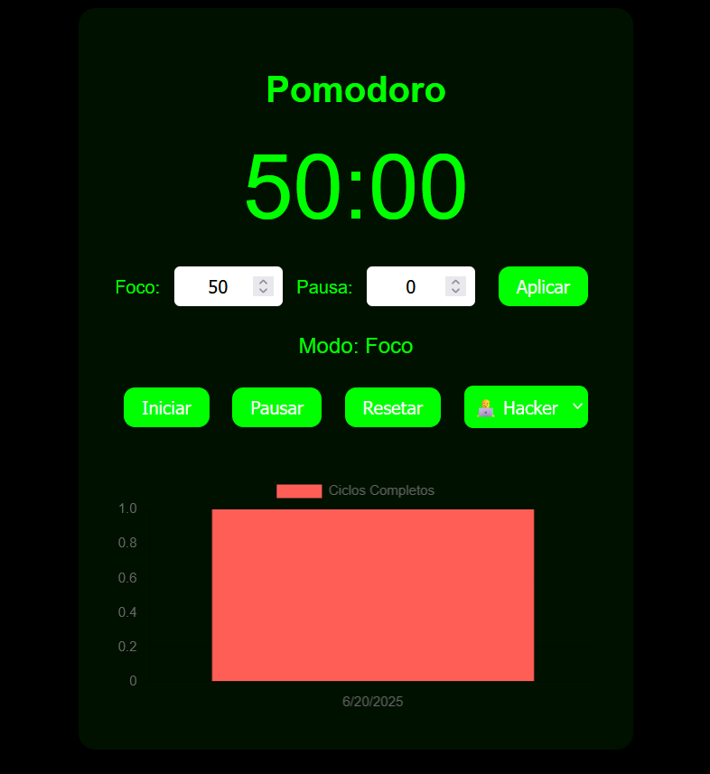

# ⏱️ Pomodoro Timer – Personalizável e Produtivo

Um app Pomodoro completo, feito com **HTML, CSS e JavaScript puro**, com foco em **personalização, ciclos automáticos e produtividade**. Ideal pra quem estuda, programa ou trabalha com foco!

## 📌 Funcionalidades

✅ **Temporizador Pomodoro clássico** (25 min foco, 5 min pausa)  
🎨 **Temas customizáveis**: Claro, Hacker e Azul  
✏️ **Edição de tempo**: personalize foco e pausa como quiser  
🔁 **Ciclos automáticos**: foco → pausa → foco...  
🔔 **Alarme sonoro** ao final de cada sessão  
💾 **Salvamento no LocalStorage**: tema, tempos e progresso  
📊 **Gráfico de produtividade** usando [Chart.js](https://www.chartjs.org/)  

## 🖼️ Preview

 <!-- Adicione uma screenshot se quiser -->

## 🚀 Tecnologias usadas

- HTML5
- CSS3 com variáveis e temas
- JavaScript (sem frameworks)
- Chart.js para o gráfico de produtividade
- LocalStorage para salvar dados

## 🧠 Como funciona

1. Escolha seu **tema favorito** no seletor.
2. Ajuste o tempo de **foco e pausa**.
3. Clique em **"Iniciar"** para começar o ciclo Pomodoro.
4. O sistema alterna automaticamente entre foco e pausa.
5. Ao final de cada ciclo de foco, um alarme toca e o ciclo é registrado no gráfico.
6. Tudo fica salvo no `localStorage` – mesmo ao fechar o navegador!

## 📦 Como rodar o projeto

```bash
# Clone o repositório
git clone https://github.com/seu-usuario/pomodoro-timer.git

# Acesse a pasta
cd pomodoro-timer

# Abra o arquivo index.html no navegador
